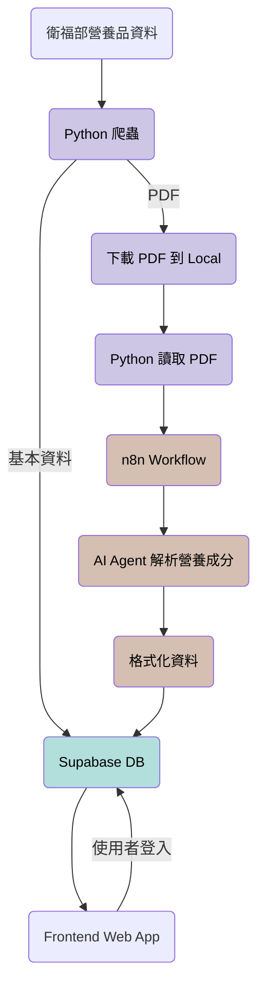

# 🥗 NutriBase
一個協助營養師快速查詢營養品營養成分，並計算病人每日攝取量的工具。

✨ [NutriBase](https://nutrition-product.vercel.app/)

## 📌 背景動機
目前營養品的營養資訊雖可於衛福部官網查詢，但多以 PDF 形式分散呈現，缺乏可直接整理與計算的輔助工具。營養師在實務上需人工彙整各項營養成分，並自行換算攝取量，流程繁瑣且容易產生錯誤。

因此本專案旨在建立一套可自動擷取營養資料並進行攝取量試算的系統，協助營養師更有效率地完成營養品份量評估與建議的工作。

## 🎯 核心功能
### 1. 病人營養需求計算
- 輸入病人基本資料（身高、體重、年齡、性別），自動計算每日所需熱量與蛋白質
- 提供可編輯的計算參數，支援依臨床需求進行客製化設定
- 協助營養師快速完成基礎營養需求評估

### 2. 營養品搜尋與管理
- 整合「特定疾病配方食品」的公開資料
- 支援依關鍵字、品牌、劑型等條件搜尋營養品
- 可將選取的營養品加入計算清單，作為後續試算使用
- 提供最近加入的歷史紀錄，方便快速選取常用營養品

### 3. 攝取量與營養成分試算
- 依所選營養品與目標熱量、蛋白質，自動計算所需攝取量
- 計算目前營養品組合佔目標熱量與蛋白質的比例
- 提供各項營養素之含量及其對應 DRIs 百分比，輔助營養評估與建議

## 🏗 系統架構

由資料擷取、資料處理與前端應用三個部分組成：

1. **資料擷取（Crawler）**
   - 使用 Python 爬取衛福部「特定疾病配方食品」資料
   - 將營養品基本資訊寫入 Supabase Database
   - 同步下載各營養品之 PDF 檔案作為後續處理來源

2. **資料處理與結構化（Automation & AI Processing）**
   - 於 local 端讀取已下載之 PDF 檔案並上傳至 n8n 處理
   - 由 n8n 中的 AI Agent 解析 PDF 內容，擷取營養成分等資訊
   - 將解析後的營養數據依預先定義之格式寫入 Supabase Database

3. **前端應用（Frontend Application）**
   - 前端將來自 Supabase 取得結構化後之營養品資料並呈現於介面上
   - 提供營養品搜尋、營養成分查詢與攝取量試算等功能

4. **使用者驗證（Authentication）**
   - 使用 Supabase Auth 處理會員登入與身分驗證
   - 以此區分會員與非會員的使用權限，並提供相應的功能限制或提示



## 🛠 Tech Stack

**Frontend**
- Next.js
- Tailwind

**Backend / Database**
- Supabase

**Data Pipeline**
- Python (crawler & data preprocessing)
- n8n (automation & AI processing)

**Deployment**
- Vercel

## 🧠 Challenges & Solutions
### 1. 非結構化 PDF 資料解析
**Problem:**  
不同品牌營養品的 PDF 格式差異甚大，初期透過 OCR 解析時錯誤率過高，導致資料無法直接使用。

**Solution:**  
透過多次調整 AI Agent 的 prompt 與解析規則，逐步優化營養成分欄位的擷取方式，並在資料寫入前加入格式檢查，使結果可轉為結構化資料後儲存至資料庫。

---

### 2. 營養資料格式標準化
**Problem:**  
不同來源的營養成分欄位命名與單位不一致，導致前端計算邏輯難以統一處理。

**Solution:**  
在資料寫入資料庫前，先於 n8n 流程中進行欄位標準化與單位轉換，透過建立字典讓翻譯的文字可以一致，並且統一資料格式後再寫入，確保進入資料庫的數據格式一致，以降低前端邏輯複雜度。

---

### 3. 前端資料呈現與需求釐清
**Problem:**  
實務上營養師關注的指標（如三大營養素比例、蛋白質量、DRIs、微量元素）與一般使用者不同，初期畫面與資料的呈現上，受限於資料取得的問題，難以有效率的支援實際工作流程。

**Solution:**  
透過與營養師反覆討論實際使用情境，逐步調整前端功能與資料呈現方式，將重點指標轉為可視化比例與彙總結果，使系統操作流程更貼近實務評估需求。

---

### 4. 資料儲存結構與會員設定設計
**Problem:**  
初期功能單純，部分設定僅存於用戶端，隨著客製化參數與加入會員專屬功能，資料需具備持久化與使用者各裝置同步能力。

**Solution:**  
重新設計資料結構，將使用者相關設定與計算參數遷移至 Database，並透過會員識別與資料關聯設計，確保不同使用者間的設定資料可獨立管理與存取。


## 🔮 Future Improvements
- **加入營養品圖片**  
  目前以產品名稱作為主要辨識方式，但對營養師而言，實際包裝外觀往往比文字名稱更容易辨認。
  未來可加入營養品圖片，讓使用者在選擇產品時能更直覺地確認品項，降低選錯產品的風險。

- **營養品標籤**  
  為營養品加上不同類型的標籤（例如：糖尿病、腎臟病、高蛋白、單素等），使用者可透過標籤快速篩選符合特定疾病或需求的營養品，提升搜尋與選擇的效率。

- **常用營養品收藏功能**  
  目前僅提供五筆近期加入紀錄，未來可讓會員將常用的營養品加入收藏清單，避免每次都需重新搜尋，提高日常使用時的操作效率。

- **會員分級系統**  
  將會員功能區分為不同等級，依等級開放不同功能（例如：可儲存設定數量、可使用進階計算功能等），為未來可能的付費機制與功能擴充預留彈性。

- **病人配置紀錄功能**  
  可儲存每次為病人規劃的營養配置內容，例如：
    - 目標熱量與蛋白質
    - 使用的營養品品項
    - 各營養品使用數量

  讓營養師能追蹤同一病人在不同時間點的營養處置方式，作為後續評估與調整的依據。

## ⚙️ Getting Started（如何執行專案）
本專案仰賴儲存在 Supabase 中的營養品資料庫。
由於資料來源與存取權限的限制，完整的資料處理流程（包含爬蟲、PDF 解析與 n8n 自動化流程）目前未開放於此專案中。

不過，仍可在本機端執行前端專案，以瀏覽系統介面設計與核心計算邏輯。

1. 下載專案
```
git clone https://github.com/ai86109/nutrition_product.git
cd nutrition_product
```
2. 安裝套件
```
pnpm install
```
3. 設定環境變數

建立 .env.local 檔案：
```
NEXT_PUBLIC_SUPABASE_URL=your_supabase_url
NEXT_PUBLIC_SUPABASE_PUBLISHABLE_KEY=your_supabase_publishable_key
SITE_URL=http://localhost:3000
```

你可以自行建立一個 Supabase 專案，並使用 mock data 進行測試。

4. 啟動
```
pnpm dev
```

開啟瀏覽器並前往：
```
http://localhost:3000
```

即可查看系統畫面。

⚠️ 注意
若未使用對應的營養品資料庫，部分功能（如營養品搜尋與實際營養成分計算）將無法完整呈現。

## 📄 Disclaimer
本專案僅作為學習與研究用途，資料來源為公開資訊，實際臨床應用仍須依專業營養師判斷為準。